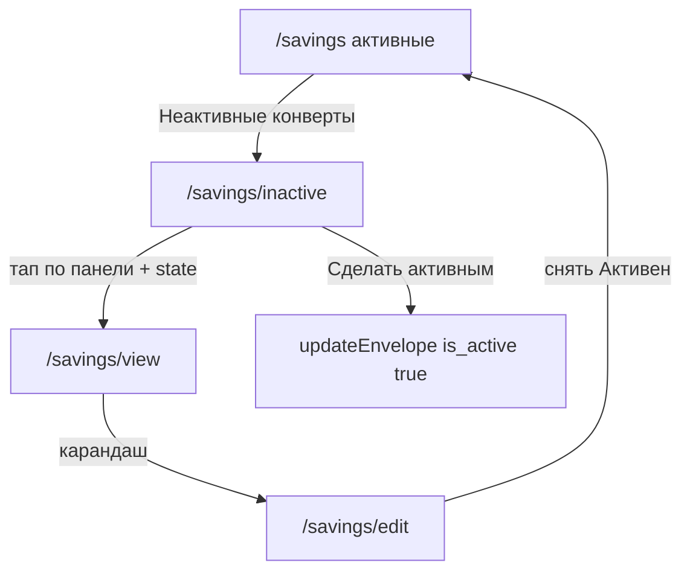

# Аналитика накоплений и архив конвертов

Дополнение к [envelopes-ui-plan.md](envelopes-ui-plan.md). Сайт на GitHub Pages: **только статические роуты**, контекст — через `location.state`.

Паттерны UI — как на странице **Аналитика** (`analytics-page.tsx`): колонка `w-full md:w-1/2 mx-auto`, крупные цифры `text-5xl font-bold` + подпись `text-sm text-surface-600`, два `Calendar`, быстрые периоды через `Tag` (`severity` success/secondary, `rounded`, `cursor-pointer`). Линейный график — как в `planning-tool.tsx`: PrimeReact `Chart` с `type="line"`, контейнер `h-80`.

## Роут (дополнение)

| Path | Назначение | Как передаём контекст |
| :--- | :--- | :--- |
| `/savings/inactive` | Список неактивных конвертов | — |

---

## 1. Неактивные конверты

### Правило списка

- Основной список на `/savings` загружает только `getEnvelopes({ isActive: true })`.
- Неактивные конверты **не показываются** среди панелей на `/savings`.
- Деактивация — как сейчас: чекбокс **Активен** на `/savings/edit` (`is_active: false`).

### Ссылка с `/savings`

Под списком активных конвертов (перед блоком динамики) — вторичная кнопка/ссылка:

- Текст: «Неактивные конверты».
- Стиль: `rounded` + `text` (как вторичные действия в приложении), full width или по центру.
- `navigate('/savings/inactive')`.
- Если неактивных нет — ссылку всё равно можно показать; на странице архива — пустое состояние.

### Страница `/savings/inactive`

Layout как у списка накоплений:

- Заголовок `text-3xl font-bold`: «Неактивные конверты».
- Назад (`pi-backward`, rounded text) → `/savings`.

Список:

- `getEnvelopes({ isActive: false })`.
- Баланс каждого — сумма операций конверта в рублях (`toRub` + `useRubRates`), как на `/savings`.
- Панель: имя в header, баланс + кнопка **Сделать активным**.
- Тап по панели (кроме кнопки) → `/savings/view` + `{ envelopeId }` (карточка доступна и для неактивных; операции можно не блокировать на первом шаге, либо скрыть Внести/Снять/Переместить — достаточно просмотра истории).
- **Сделать активным**: `updateEnvelope(id, { is_active: true })`, затем убрать панель из локального списка (или перезагрузить). Без confirm-диалога.

Пустое состояние: «Нет неактивных конвертов».

---

## 2. Блок «Динамика накоплений» — низ `/savings`

Секция **под** списком активных конвертов и ссылкой на архив. Не отдельная страница — часть `/savings`, по духу как блок фильтров + цифр на Аналитике.

### Layout (сверху вниз)

1. **Заголовок секции** — `text-xl font-semibold` или `text-2xl font-bold`: «Динамика накоплений».
2. **Крупные цифры изменения** (как блок «потрачено» на Аналитике):
   - Главная цифра `text-5xl font-bold`: изменение баланса за период со знаком (`+12 500` / `−3 200`) и «руб».
   - Цвет: рост — success/зелёный тон, падение — warning/красный (или нейтральный, если ноль).
   - Подпись: «изменение накоплений за период».
3. **Две доп. крупные метрики** (сетка `grid-cols-1 sm:grid-cols-2`, как в planning-tool):
   - **Внесено** за период + подпись «внесено за период».
   - **Снято** за период + подпись «снято за период».
4. **Период** — сетка `grid grid-cols-2 gap-4`, как на Аналитике:
   - Колонка «Дата от»: `Calendar` (`dateFormat="dd.mm.yy"`, `showIcon`, `className="w-full"`).
   - Колонка «Дата до»: такой же `Calendar`.
   - Под «Дата от» (или общей строкой под обоими) — теги быстрых периодов:
     - «за текущий квартал»
     - «за текущий год»
   - `Tag`: `rounded`, `severity={selected ? 'success' : 'secondary'}`, `className="cursor-pointer select-none"`.
   - Клик по тегу выставляет `dateFrom`/`dateTo` и подсвечивает выбранный тег; ручное изменение календаря сбрасывает выделение тега.
5. **График** — под фильтрами:
   - Подпись/заголовок по желанию («Баланс по дням»).
   - Контейнер `h-80`, внутри `<Chart type="line" … className="h-full w-full" />`.
   - Одна серия: накопленный суммарный баланс всех конвертов в рублях на конец каждого дня периода.
   - Стиль линии как у факта в planning-tool: `tension: 0.2`, `pointRadius: 3`, `borderWidth: 2`, легенда снизу.
   - `maintainAspectRatio: false`.

### Быстрые периоды

| Тег | `dateFrom` | `dateTo` |
| :--- | :--- | :--- |
| за текущий квартал | 1-е число текущего календарного квартала (янв/апр/июл/окт) | сегодня (начало дня) |
| за текущий год | 1 января текущего года | сегодня |

### Период по умолчанию

При открытии `/savings`: **за текущий год** (1 янв → сегодня), тег «за текущий год» активен.

Опционально позже: помнить `dateFrom` в `localStorage` (как `half_analytics_date_from` на Аналитике) — не обязательно в первой версии.

---

## 3. Расчёты

Источник: `getSavingsOperations()` (все операции; фильтр дат на клиенте). Валюты → рубли через `toRub` / `useRubRates`.

Обозначения:

- Операции до начала периода: `created_at < startOfDay(dateFrom)`.
- Операции в периоде: `created_at` от `startOfDay(dateFrom)` до `endOfDay(dateTo)` включительно.

### Баланс и график

1. **Баланс на начало периода** = сумма `toRub` всех операций строго до `dateFrom`.
2. По дням периода (включительно) строится **running total**: старт = баланс на начало; за каждый день добавляется сумма операций этого дня.
3. Точки графика: для каждого дня — running total на конец дня (дни без операций — горизонтальный участок).
4. **Изменение за период** = баланс на конец `dateTo` − баланс на начало = сумма `toRub` операций внутри периода (net).

Переводы `TRANSFER_IN` / `TRANSFER_OUT` между своими конвертами в сумме net по всем конвертам дают ~0 и **не раздувают** «изменение накоплений».

### Внесено / снято

Считаются только по операциям **внутри** периода, в рублях:

| Метрика | Типы |
| :--- | :--- |
| Внесено | `DEPOSIT` + `TRANSFER_IN` (сумма положительных вкладов в конверты) |
| Снято | модуль сумм `WITHDRAWAL` + `TRANSFER_OUT` |

Показ «внесено/снято» отражает движение по конвертам; главное число **изменения** остаётся net (running total), чтобы внутренние переводы не выглядели как рост капитала.

Альтернатива на будущее (не в первой версии): «внесено/снято» только `DEPOSIT` / `WITHDRAWAL` без transfer — тогда цифры ближе к «деньги снаружи».

### Верхняя цифра страницы

Крупный итог «накопления по всем конвертам» наверху `/savings` — по-прежнему **текущий** суммарный баланс. Имеет смысл считать его по операциям **активных** конвертов (чтобы архив не искажал «живые» накопления); операции неактивных остаются доступны на `/savings/inactive` и в истории карточки. Уточнить при реализации, если сейчас в total попадают все операции без фильтра по `is_active`.

---

## 4. Что не делаем в этом объёме

- Отдельная страница «Аналитика накоплений» — нет, блок на `/savings`.
- Удаление конвертов — по-прежнему нет.
- Фильтр графика по одному конверту — нет (только суммарно).
- Теги «неделя / месяц» как на Аналитике — нет; только квартал и год.
- Серверный `from`/`to` у `getSavingsOperations` — опционально позже, по аналогии с `getTransactions`.

---

## 5. Файлы при реализации (ориентир)

| Файл | Изменение |
| :--- | :--- |
| `App.tsx` | Роут `/savings/inactive` |
| `savings-page.tsx` | Ссылка на архив; секция динамики (календари, теги, цифры, Chart) |
| новый `savings-inactive-page.tsx` (или рядом) | Список неактивных + «Сделать активным» |
| `savings-utils.ts` | Хелперы периода (квартал/год), running total, метрики |
| `api/index.ts` | Без обязательных изменений; при желании — `from`/`to` у операций |
