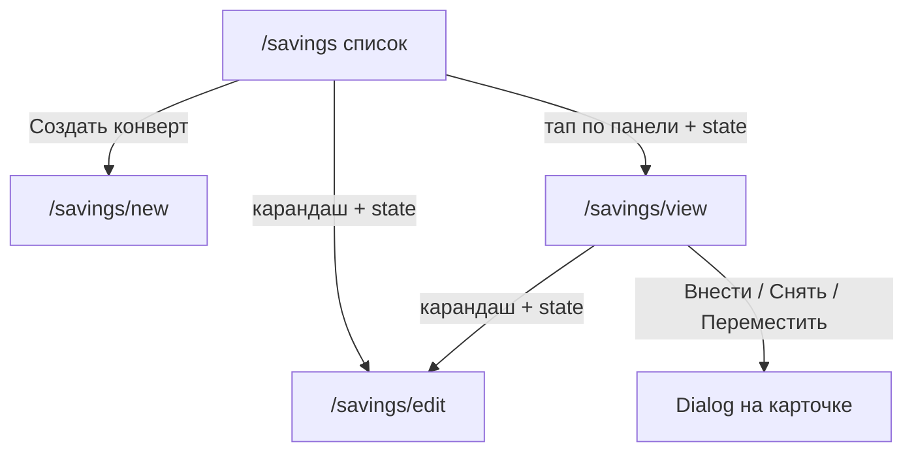

# UI конвертов (накопления)

Сайт на GitHub Pages: **только статические роуты, без `:id` в path**. Идентификатор конверта передаём через `location.state` (как у `/close-period`).

## Принципы (как в текущем UI)

- Колонка `w-full md:w-1/2 mx-auto`, заголовок `text-3xl font-bold`, назад — круглая кнопка `pi-backward`.
- CRUD конверта — отдельные **страницы** (как `EditPage`), не Dialog.
- История операций — `DataTable` + `Column` (как Транзакции).
- Кнопки: full width + `severity` на Home; вторичные — `rounded` + `text` + иконка.
- Валюты — `CurrencyRates` + `useRubRates`; в БД пишем `amount` + `currency`.
- Поле `user` — из `half_selected_user`.

## Роуты (все статические)

| Path | Назначение | Как передаём контекст |
| :--- | :--- | :--- |
| `/savings` | Список конвертов | — |
| `/savings/new` | Создание конверта | — |
| `/savings/edit` | Редактирование конверта | `state: { envelopeId }` |
| `/savings/view` | Карточка конверта | `state: { envelopeId }` |

Примеры навигации:

- `navigate('/savings/new')`
- `navigate('/savings/view', { state: { envelopeId } })`
- `navigate('/savings/edit', { state: { envelopeId } })`

Если на `/savings/view` или `/savings/edit` нет `envelopeId` в state (обновление страницы) — редирект на `/savings`.

## 1. Список — `/savings` (уже есть)

- **Создать конверт** → `/savings/new`.
- Тап по панели (кроме карандаша) → `/savings/view` + `envelopeId`.
- Карандаш → `/savings/edit` + `envelopeId`.

## 2. Создать — `/savings/new` / править — `/savings/edit`

Страница в стиле `EditPage`.

- Заголовок: «Новый конверт» / «Редактировать конверт».
- Назад: с new — на `/savings`; с edit — на `/savings/view` (с тем же `envelopeId`), если пришли с карточки, иначе на `/savings`.

Поля:

- **Название** — `InputText`, обязательно.
- **Описание** — `InputTextarea`, опционально.
- Только edit: чекбокс **Активен** (`is_active`); выкл. = архив (нет в списке активных).

Низ: **Сохранить** (`severity="success"`, full width). Удаление конверта не делаем.

После создания — переход на `/savings/view` с новым id (или на `/savings`). После сохранения edit — на `/savings/view` с тем же id.

## 3. Карточка — `/savings/view`

- Заголовок = `name`; назад → `/savings`; карандаш → `/savings/edit` + `envelopeId`.
- Баланс крупно (`text-5xl`) в рублях + подпись «баланс конверта».
- Описание конверта — мелким текстом, если есть.
- Кнопки: **Внести** (success), **Снять** (warning), **Переместить** (info) — столбиком на мобилке / в ряд на широком.
- Таблица операций (`DataTable`), только по этому конверту:
  - Дата (`created_at`)
  - Тип: Внесение / Снятие / Перевод → / Перевод ←
  - Сумма со знаком и цветом + код валюты (например `+100 USD`)
  - Комментарий
  - Для переводов: «из/в {имя другого конверта}» через `related_operation_id`

Редактирование и удаление строк операций не делаем.

## 4. Внести / Снять / Переместить — Dialog на карточке

Один `Dialog`, режим `deposit | withdraw | transfer` (Dialog в проекте ещё не использовался).

Общие поля: сумма (`InputNumber`, всегда положительная в форме), валюта (`CurrencyRates`), комментарий (`InputTextarea`).

Запись в БД:

- **Внести** → `DEPOSIT`, `amount > 0`, `related_operation_id = null`.
- **Снять** → `WITHDRAWAL`, `amount < 0` (знак минус при сохранении).
- **Переместить** → dropdown «Куда» (другие активные конверты) → две строки `TRANSFER_OUT` / `TRANSFER_IN` с взаимным `related_operation_id`; суммы противоположного знака, одна валюта.

После успеха: закрыть Dialog, обновить операции и баланс на карточке.
